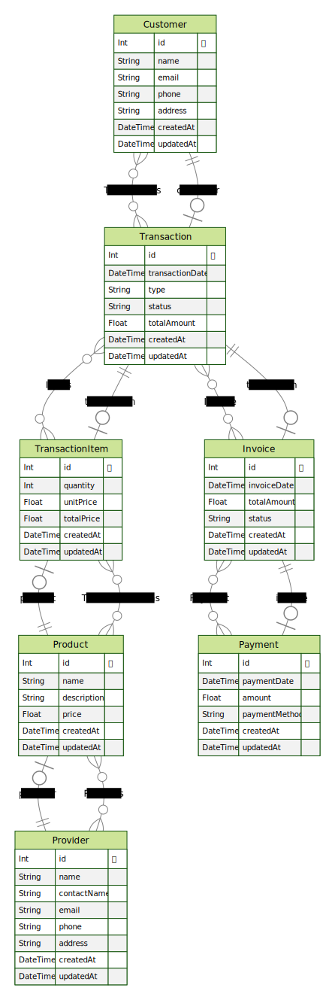

# Project Title

Description of the project.

## ERD



## Prerequisites

- Node.js (version X.X.X)
- PostgreSQL (version X.X.X)

## Setup

1. Clone the repository:
   ```
   git clone https://github.com/username/repo.git
   ```

2. Install dependencies:
   ```
   npm install
   ```

3. Setup Prisma database:
   - Create a PostgreSQL database
   - Update the `DATABASE_URL` environment variable in `.env` file
   - Run `npx prisma db push` to apply database migrations

## Running the Application

Run `npm run dev` to start the development server.

## Running Tests

Run `npm test` to execute the test suite.

## Deployment

Deployment instructions here.

## Contributing

Contribution guidelines here.

## Authors

- [Author Name](https://github.com/username)

## License

This project is licensed under the [License Name] License - see the LICENSE.md file for details.
